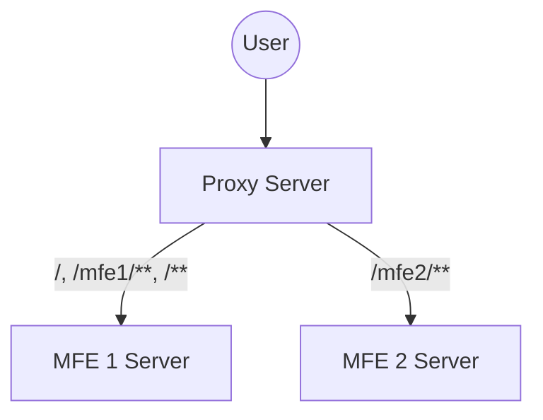

# Angular Route Sharding Micro-Frontend

This is a "micro-frontend" app implemented via route sharding.

## Features

*   No module federation or any of the complexity that brings.
*   `application` builder-compatible.
*   SSR-compatible.
*   No community libraries.
*   Minimal performance cost.
*   MFEs can use any framework or none at all.

## Costs

*   Micro-frontends must be separated by routes.
    *   You can still use module federation to put two MFEs on the same page,
        you just don't _need_ to unless it is useful to do so.
*   Navigating between micro-frontends requires a hard navigation.
*   Requires an additional proxy server deployment in additional to MFE deployments.
*   Route claiming and discovery may benefit from additional tooling.
    *   Additional tooling for managing routes is by no means required and none is
        included here. As a project scales managing routes may becomes slightly more
        painful over time which tooling could potentially mitigate.
*   Navigating to 404 routes not claimed by any MFE is always a hard navigation.
    *   This is a technical constraint due to MFEs not having knowledge of each
        other's routes, see [Unclaimed Routes](#unclaimed-routes).

## Architecture

Micro-frontends want an isolated environment where they can be live independently
of all other apps built at different times with unknown code. Typically, module
federation allows multiple apps to be independently bundled but exist on the same
page and share code. However, browsers already have a mechanism for creating truly
isolated environments between applications: web pages.

Each page load is completely isolated from the ones before and after. This MFE
approach takes advantage of that by "sharding" application routes between MFEs.
Each MFE "claims" a set of routes in the application. When a user navigates from
one route to another within the same MFE, it performs normal "soft" navigations
between them. When the user visits a route owned by a different MFE, it performs
a hard navigation and loads that MFE from scratch.

A small proxy server makes this work by serving all apps on the same origin and
knowing which route is owned by which MFE. It then proxies each request to the
relevant server which owns that MFE.



In this repository, MFE1 claims `/mfe1/**` routes while MFE2 claims `/mfe2/**`.
MFE1 also claims the root (`/`) and all other 404 routes (`/**`). MFEs don't strictly
need to place all their routes under a specific directory (MFE1 does not since it
claims `/`), but it can be convenient to do so.

This architecture gives each MFE full control over all the routes they claim with no
risk of interference by other MFEs. MFEs don't even need to know the routes claimed
by other MFEs, only the proxy server has this knowledge and uses it to route to the
correct MFE.

## Local Development

```shell
# Install the repo.
npm ci

# Run the whole stack in dev mode.
npm start # Hosted on `http://localhost:4200`.

# Run the whole stack with production optimizations.
npm run prod # Hosted on `http://localhost:4200`.

# Alternatively, develop on just one MFE.
npm run mfe1 # Hosted on `http://localhost:4201`.
npm run mfe2 # Hosted on `http://localhost:4202`.
```

## FAQ

### Is this technically an MFE?

This depends on your definition of "micro-frontend". Does it require getting multiple,
independently-built web applications to interoperate with each other in a single user
experience? Or does it specifically require getting independently-built JavaScript
code to coexist on the same page? If you choose the latter definition, then no, this
is not an MFE architecture.

However, I choose the former definition. Because the technical solution to any given
problem doesn't matter as long as it solves that problem. Here, the problem is release
independence of multiple web applications which coexist in the same user experience.
That user experience could do soft navigations everywhere with module federation or
hard navigations across MFEs. If the MFE boundaries are picked intelligently and
performance is solid the user won't notice the difference.

"Well, if you can't tell, does it matter?"

### How do I share code between MFEs?

Use a shared library which is built with each MFE.

It is comparatively easy to create shared libraries and then use those libraries
across multiple applications. Each application can build its library dependencies and
include its own copy of them. Since these apps are "MFEs", each MFE gets its own
version of that dependency, meaning they are not tied to a single version or forced
to upgrade in lock-step.

If you really want to use module federation to link in a library built at a different
time, that is possible with this architecture. Nothing actively prevents it. This
architecture just makes the need for module federation as a solution significantly
less important and many more use cases can get by without needing to pull on that
particular lever.

### What are the performance implications?

Every navigation between different MFEs is a hard navigation, therefore the browser
needs to effectively start over from scratch. This makes initial page load performance
significantly more important than a typical SPA. SSR is especially important to mitigate
this particular rough edge.

Performance within a single MFE is effectively unchanged compared to treating each MFE
as an independent application because each MFE _is_ an independent application. There is
no overhead cost they need to pay to work together. Internal navigations work just like
any other SPA and have identical performance to a non-MFE app. It's only cross-MFE
navigation which must be hard navigations and pay that particular performance cost.

It's worth remembering that all MFE solutions have a performance cost to provide app
isolation.


To demonstrate this, imagine a federated application with a single copy of a dependency
`foo` loaded at runtime. This copy is shared between multiple MFEs, meaning there is less
code to download and execute at runtime. However, when `foo` needs to be updated, both
MFEs need to update in lockstep and be compatible with the new version at the same time.
The two apps are intrinsically coupled together, they are both affected by the same
change. We're trading away isolation of this dependency for improved performance.

Alternatively, we can copy the `foo` dependency between the two apps, each gets its own
version and can upgrade on their own timeframe. This effectively isolates the two apps
and prevents an upgrade in one from breaking the other. However it also duplicates `foo`
at runtime and users now need to download two copies of it. We've traded away performance
for improved isolation.

Every MFE approach lives somewhere on this spectrum.

Module federation in particular negatively impacts tree shaking and forces users to make
hard decisions around which dependencies are duplicated for better isolation or shared
for improved performance.

This route sharding architecture makes its own trade offs in this space, but this
approach is comparatively better isolated than module federation (no shared dependencies
at all) while the performance cost (hard navigations between MFEs) can be effectively
mitigated for SSR-enabled applications with strong initial page load performance.

### How do we get multiple MFEs to work together?

They link to each other (and maybe write to shared storage).

MFEs by their nature are supposed to be independent applications without tight coupling
between each other. Having one MFE closely coupled or dependent on another is a design
smell. MFEs generally shouldn't share state or have specific knowledge of each other
wherever it can be avoided. This is very similar to RPC microservices which frequently
use independent data stores to avoid unintentional coupling through leaking data.

On the web, MFE state such as "What project am I operating on" should typically be kept
in query parameters where MFEs can link between each other to propagate that state. More
complex data like user authentication tokens or a data cache might be saved to an
IndexedDB store with a common library to read/write to it across multiple MFEs. This
allows one MFE to request some data, store it in the browser, and then the next MFE can
read the same data without having to duplicate the request.

MFE isolation is more of a theoretical ideal than it is a practical goal, but the point
here is that we don't need send references of JS functions from one MFE to another in
order to have a cohesive application. The exact mechanisms for how to handle these
integrations will vary form app to app based on the exact UX requirements.

### How does caching work?

By default, each MFE is effectively cached independently of each other. If there is a
significant amount of shared code/data between MFEs, it is potentially possible to have a
shared CDN, browser cache, or data cache (stored in IndexedDB perhaps) which allows this
data to be reused across MFEs. This example does not go to that extent, but it is entirely
feasible to do so.

## Hacks

To make this work I had to come up with a few tricks for getting things routed correctly.
I'm listing them out here just for documentation purposes and to discuss some of the
negative trade offs of this approach, but none of these hacks are really all that bad IMHO.
They just create some slightly rough edges.

### Navigating Between Routes

[`routerLink` does not support navigating to routes outside the application](https://github.com/angular/angular/issues/24567#issuecomment-877301902),
meaning it will never perform a hard navigation to another MFE.

To make this happen, we add a 404 route handler with a guard which triggers a hard
navigation. This is not really how guards are supposed to work, but it seems to work
well enough.

```typescript
{
  path: '**',
  canActivate: [
    (route: ActivatedRouteSnapshot) => {
      // ...

      // Must be a client-side navigation to a URL outside this MFE,
      // therefore we perform a hard-navigation.
      const platform = inject(PLATFORM_ID);
      if (isPlatformBrowser(platform)) {
        window.location.href = `/${route.url.join('/')}`;
      }

      return false;
    },
  ],
  loadComponent: () => { /* ... */ },
},
```

### Unclaimed Routes

Routes not claimed by any MFE are effectively 404 routes. However this presents the
challenge of rendering that 404 page. If MFEs assume all routes they don't claim are
owned by some other MFE and perform a hard-navigation to it, then how do we convince
one to render a 404 route that no MFE claims?

The trick here is also in the 404 router handler guard, where it skips performing a
hard navigation for the initial navigation of the page.

```typescript
{
  path: '**',
  canActivate: [
    (route: ActivatedRouteSnapshot) => {
      // Render this route for a hard-navigation. This can happen for 404 routes outside any MFE.
      // The proxy server may forward those requests to this MFE, so we allow the initial render.
      const navTracker = inject(NavigationTracker);
      if (!navTracker.hasNavigated) return true;

      // If we got here, must be a post-initial page load navigation to an unknown route, therefore
      // perform a hard navigation...
    },
  ],
  loadComponent: () => import('../not-found/not-found.component').then((m) => m.NotFoundComponent),
},
```

It's a bit weird to make the router behave differently for initial renders vs subsequent renders,
but sufficient to get the job done.

### Hard Navigation to Unclaimed Routes

The key constraint here is that no MFE can disambiguate between a route that MFE doesn't own and a
route which _no_ MFE owns. Only the proxy server can tell the difference as it is the only
deployment with knowledge of all the MFEs and their route claims. As a result, any outgoing link to
a route not claimed by the current MFE must be hard navigation, even if the proxy server will
ultimately route them back to the same MFE to display that 404 route.

This issue only exists for 404 routes not claimed by _any_ MFE. An MFE can still claim
`/my_routes/**` and perform soft navigations to and from 404 navigations within that pattern.

Fortunately, linking from an unclaimed 404 route directly to _another_ unclaimed 404 route is
likely to be incredibly rare, so this is practically a non-existent issue in practice. Even
navigating from the MFE owning unclaimed routes to an unclaimed route should be on the rarer side,
and solid SSR support can mitigate the performance impact of those navigations.

There are other solutions such as making the MFE which handles unclaimed 404 routes have knowledge
of all the other MFE routes. This would allow it to disambiguate between a navigation to another MFE
and a navigation to an unclaimed route. However, doing so would require that the MFE which handles
unclaimed 404 routes needs to be updated and redeployed any time the route claims for any other MFE
change which could be tricky to manage.

Instead, I opted to limit this design so only the proxy server has knowledge of all MFE claims and
is the only other system which needs to be redeployed when route claims change. This issue can also
be mitigated by having stable route claims. For example, limiting an MFE to a subpath like
`/mfe1/**` means that it has full control over routes under `/mfe1/**` and can add/remove them at
will without affecting the proxy server or any other MFE. It's only when adding a new claim outside
`/mfe1/**`, such as `/some/other/route` where the proxy server needs to be updated to route
correctly.
